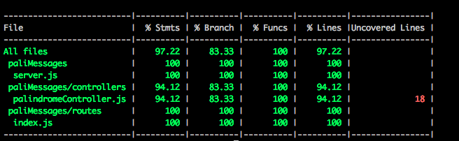
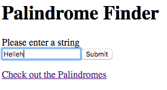
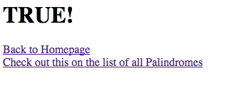
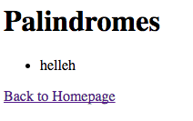
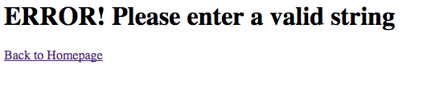

# A Palindrome Sorter built in Node

The task:

Build a service that stores a number of palindromes. Needs an endpoint that returns true if the string entered is a palindrome (and false if not), and an endpoint that returns a list of the last 10 palindromes the system has received (does not have to be stored in a DB).

## How to Run
* Clone or download this repo to your local machine.
* Navigate to the project folder using your terminal.
* Run **npm install** to install dependencies for the project.
* Run **npm start**, and then navigate to http://localhost:3000/ to see the application running.
* Run **npm test** to run the test suite and see coverage.

### Technologies Used
* Node.js
* Express.js
* Pug
* Mocha & Zombie

### My approach, challenges and lessons learnt
---
#### Approach
* My approach was to use TDD to build a very basic version of the application in the simplest possible way.
* I used a design approach which separated the routes, controllers & views. The routes solely pointed the server as to which path to go and which controller to open. The controller contained the logic and the views were completed using a templated called Pug.
* I tested using Zombie as there was no database issues and I felt this was suitable for the challenge.
* The core logic is stored in the new Palindrome function. This is where words entered are checked if they are a palindrome, and then printed on the page. I would separate these concerns out if I spent more time on the problem and developed it further.
---
#### Challenges
* No database meant I struggled at first to think of a solution to print the 10 palindromes. I decided to push valid words into an array and then print. I used the splice method to replace the first index of that array when the length reached 10, but this needs to be amended as it always replaces index 0, which is always the most recently stored word after the initial 10.
* Form submission on testing was tricky to enable it to work correctly. More around async/await will be needed.
---
#### Lessons Learnt
* Learnt more about async/await, and also req, res and errors when creating functions.
* Researched Koa as an alternative to Express - which seems heavily reliant on async/await.
* Have to be creative when not storing results in a database.
* Testing and form submission, with how to use async/await.

**Coverage**

### To Do
* Styling.
* Test the 10 saved palindromes for 100% coverage.
* Replace the oldest palindromes when the length get's to 10, not the newest.

### ScreenShots

**Homepage**

**Confirmation of a Palindrome**

**Palindrome Screen**

**Error Screen**

